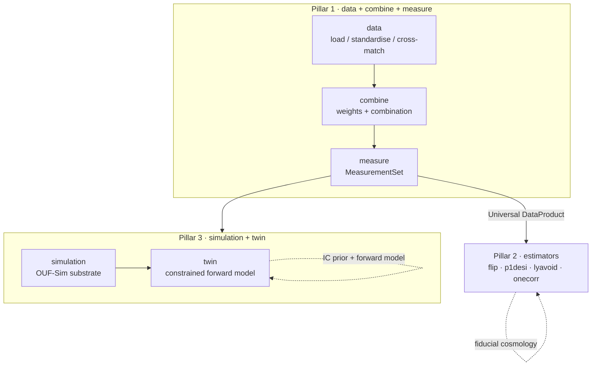

# Architecture

`oneuniverse` is the anchor of a three-pillar cosmology stack whose long-term
goal is a **digital twin of the Universe** — a single posterior on the matter
density + velocity field built by combining every cosmological observation.

## The pillars

| Pillar | Mission | Subpackage(s) | Owns cosmology? |
|---|---|---|---|
| **1 — Data, Combine, Measure** | Ingest catalogs → standardise → cross-match → combine → emit a `MeasurementSet` for downstream tools | [`data`](api/data.md), [`combine`](api/combine.md), [`measure`](api/measure.md) | **No** |
| **2 — Estimators + Likelihoods** | Compute P(k), ξ(r), Cℓ, multi-tracer cross-correlations, fits, forecasts | *external (flip, p1desi, lyavoid, …)* | **Yes** (fiducial at call site) |
| **3 — Simulation / Digital Twin** | Constrained Bayesian forward modelling, per-survey observation models, incremental updates | [`simulation`](api/simulation.md), [`twin`](api/twin.md) | **Yes** (in the IC prior and forward model) |

### The cosmology rule

Pillar 1 stores survey-delivered data **verbatim**, with observational metadata
only (frame, epoch, wavelength convention). H₀ / Ωₘ / a fiducial baseline / a
distance model **never** touch the catalog — they enter at Pillar 2 (per
estimator call) and Pillar 3 (per inference run). This keeps the same prepared
data reusable under any fiducial.

## Pillar 1 — data → combine → measure

- **[`data`](api/data.md)** — fast loading of galaxy survey catalogs with a
  standardised schema, spatial/redshift selections (`Cone`, `Shell`,
  `SkyPatch`), cross-survey matching (ONEUID), sub-object links, and the on-disk
  **OUF** format (HEALPix-partitioned Parquet + `manifest.json`). Column names
  are lowercased and standardised; RA/Dec are stored in **degrees (ICRS)** with
  no h-factor.
- **[`combine`](api/combine.md)** — every weight (FKP, inverse variance, column,
  quality mask, PIP bitweight, shear) and the cross-survey combination of
  measurements. Public registration via `default_weight_for(...)`.
- **[`measure`](api/measure.md)** — the P1→P2 connection. Builds the **Universal
  DataProduct** (`MeasurementSet`, and the `PointSet` / `Sightline` / `FieldMap`
  representations) from a prepared catalog: randoms, window, jackknife, n(z),
  region map — all cosmology-free.

## Pillar 3 — simulation → twin

- **[`simulation`](api/simulation.md)** — **OUF-Sim**, a format-agnostic storage
  and orchestration substrate for cosmological simulations (multi-backend
  adapter registry, execution plans, backend capabilities, cosmology/unit-frame
  specs, region selectors).
- **[`twin`](api/twin.md)** — the data ↔ simulation coupling layer: mock tracer
  fields, Wiener reconstruction, constrained realizations, mock-challenge
  harness and recovery metrics.

## Storage: the OUF format

On disk a survey lives under `{survey_path}/oneuniverse/`:

- a `manifest.json` describing the schema, weights and photo-z PDF spec;
- HEALPix-NSIDE32-**NEST**-partitioned Parquet (auto-coarsened for small
  catalogs).

**CORE columns:** `ra, dec, z, z_type, z_err, galaxy_id, survey_id,
_original_row_index, _healpix32`. `z_type ∈ {spec, phot, phot_pdf, pv, none}`.

## Where to go next

- [API reference](api/index.md) — the public API of each subpackage.
- The in-repo `CLAUDE.md` and `plans/` hold the full phase roadmap and design
  notes.
