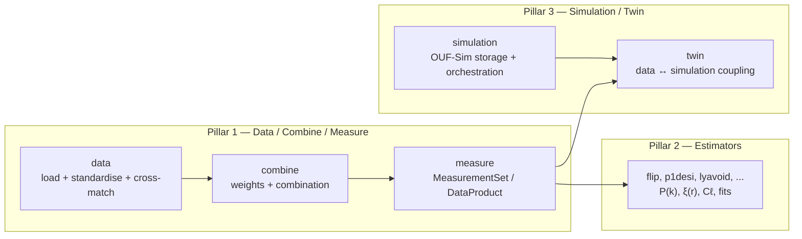

# oneuniverse

**A toolkit for turning messy, heterogeneous cosmology survey catalogs into one
clean, queryable, analysis-ready dataset — and for storing and resimulating the
cosmic web that produced them.**

If you work with survey data (galaxies, quasars, peculiar velocities, supernovae,
weak-lensing shapes, Lyman-α forests, CMB/HI maps) you spend a lot of time on the
same plumbing: reading FITS into a common shape, matching the same object across
surveys, applying the right weights, generating randoms, building n(z), and
packaging it for an estimator. `oneuniverse` does that plumbing once,
consistently, and hands you a single object — a **`MeasurementSet`** — that any
downstream estimator can consume.

It is deliberately **cosmology-free** on the data side: cuts, weights, frames and
metadata are stored verbatim, but H₀ / Ωₘ / a distance model never touch your
catalog. You choose the cosmology later, at the estimator call — so the same
prepared data is reusable under any fiducial.

## The three pillars

`oneuniverse` is organised as a three-pillar cosmology stack — the long-term goal
is a *digital twin of the Universe* built by combining every observation into a
single posterior on the matter density + velocity field.



| Pillar | Subpackage(s) | Role |
|---|---|---|
| **1 — Data, Combine, Measure** | [`data`](api/data.md), [`combine`](api/combine.md), [`measure`](api/measure.md) | Ingest catalogs → standardise → cross-match → weight → emit a `MeasurementSet` / Universal DataProduct |
| **2 — Estimators** | *(external: flip, p1desi, lyavoid, …)* | Compute P(k), ξ(r), Cℓ, multi-tracer cross-correlations, fits, forecasts |
| **3 — Simulation / Twin** | [`simulation`](api/simulation.md), [`twin`](api/twin.md) | OUF-Sim storage substrate; constrained forward modelling and mock challenges |

**Cosmology rule.** Pillar 1 stores survey-delivered data verbatim with
observational metadata only (frame, epoch, wavelength convention). Cosmology
enters at Pillar 2 (per estimator call) and Pillar 3 (per inference run).

## Quick look

```python
import oneuniverse as ou

df = ou.load_catalog("sdss_mgs", selection=ou.Shell(0.02, 0.08))
print(df.columns)        # lowercase, standardised oneuniverse names
```

## Next steps

- [Getting started](getting-started.md) — install and load your first catalog.
- [Architecture](architecture.md) — the pillars, OUF format, and the
  `MeasurementSet` contract.
- [API reference](api/index.md) — the public API of each subpackage.

!!! note "Conventions"
    RA / Dec are stored in **degrees (ICRS)**; there is no h-factor in storage.
    Comoving conversion happens downstream, in Pillars 2/3.
